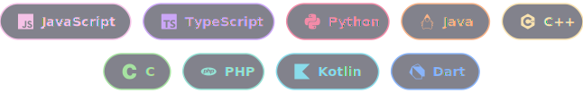
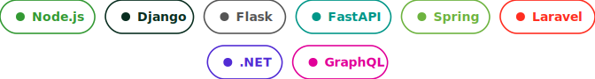
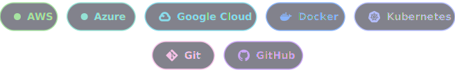

 

## about me

I'm a software engineering student focused on **AI & Data Science** — I like taking messy, real problems and turning them into software that actually works.

Right now I'm building an **AI-powered ERP with a conversational assistant** that can carry out real business operations on request — think less chatbot, more digital coworker.

**Currently exploring:** LLMs, MLOps, and the space between AI and good UI/UX design.
**Open to:** freelance work and junior software engineering roles.

 

## tech stack

**Languages**
 

  

**Frontend**
 

  

**Backend & APIs**
 

  

**Mobile**
 

  

**AI / Data**
 

  

**Databases**
 

  

**Cloud & DevOps**
 

  

**Tools**
 

 

## stats

###  GitHub Stats

  
  

 

 

## let's connect

 

<!--
PERMANENT FIX FOR THE STATS CARDS ABOVE:
The "GitHub stats" and "top languages" cards use a free service shared by
thousands of GitHub profiles, so it frequently rate-limits and shows broken
images. To fix this for good (takes ~2 minutes, free):
  1. Go to https://github.com/anuraghazra/github-readme-stats
  2. Click "Deploy on Vercel" and log in with your GitHub account
  3. Once deployed, you'll get your own URL like
     https://github-readme-stats-yourname.vercel.app
  4. Replace "github-readme-stats.vercel.app" in the two  URLs above
     with your own deployed URL
Now only you are using that server, so it will never rate-limit again.
-->
